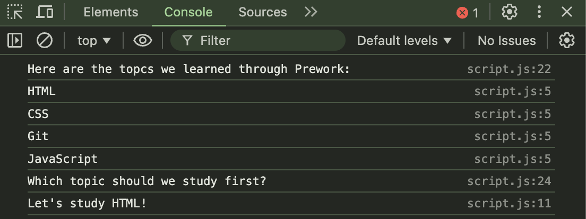

# prework-study-guide

## Description

This project was made to practice the basics of web development and coding. I built this project to practice and understand better HTML, CSS, Javascript, Command Line, Git, and GitHub. On top of that, It also serves as an actual study guide to store and practice current and new information on these topics.

## Installation

N/A

## Usage

Upon opening the HTML file you can also open the dev tools and look at the console; There you will see all the topics with another message stating one of the following: "Let's Study HTML," "Let's Study CSS," "Let's Study Javascript," "Let's Study Git." It will change each time the page is refreshed and can be used as a starting point for what to study in that session.

## Credits

N/A

## License

Please refer to the LICENSE in the repo.
